This is my write-up for the TryHackMe room on [TakeOver](https://tryhackme.com/room/takeover). Written in 2026, I hope this write-up helps others learn and practice cybersecurity.

## Task 1: Help Us

The CEO and co-founder of **futurevera.thm** says their space research website is being threatened by blackhat hackers demanding ransom, claiming they can take over the site. They are asking for help to identify what the attackers could compromise.

The target website is:

> [https://futurevera.thm](https://futurevera.thm)

There is a hint to add this entry to `/etc/hosts`:

```bash
IP_MACHINE futurevera.thm
```

The task is to investigate the website and determine what can be taken over, then find the **flag value**.

Okay, I'm using RustScan here, so let's run it:

```bash
rustscan -a IP_MACHINE
```

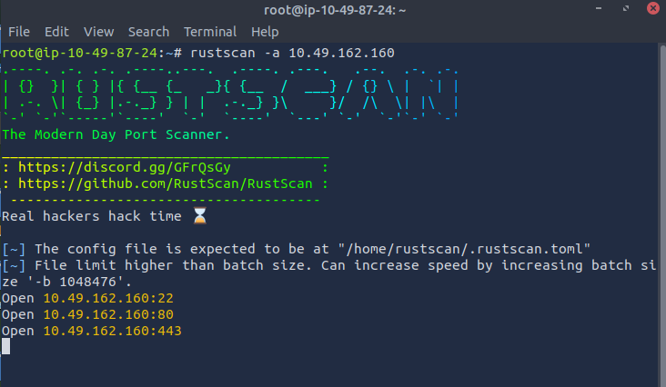

We found 3 open ports:

```bash
PORT    STATE SERVICE REASON
22/tcp  open  ssh     syn-ack
80/tcp  open  http    syn-ack
443/tcp open  https   syn-ack
```

However, when we open the website, we get:

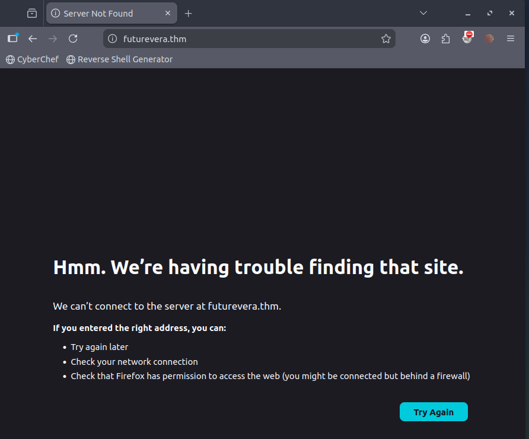

We need to edit the hosts file to add the IP:

```bash
sudo nano /etc/hosts
```

Then we add:

10.49.162.160   *.futurevera.thm
10.49.162.160   futurevera.thm

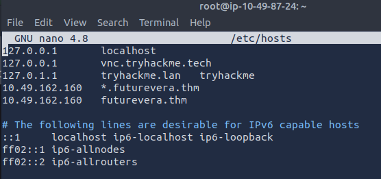

The website can be opened, but there is a security warning:

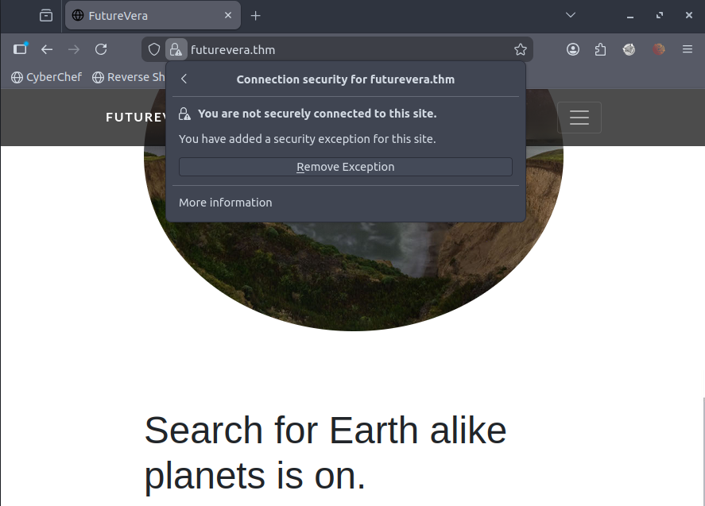

Let's run Gobuster:

```bash
gobuster dir -vv -o gob -u https://10.49.162.160 -w /usr/share/wordlists/dirb/common.txt -k
```

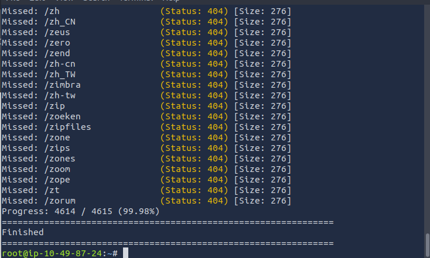

Nothing was found, so we'll try subdomain enumeration. Here, I'm installing SecLists:

```bash
snap install seclists
```

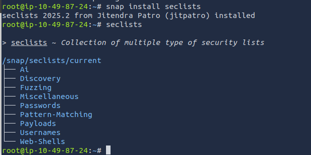

Using the information from that directory, let's run the wordlist:

```bash
gobuster vhost -vv -k --append-domain -u https://futurevera.thm -w /snap/seclists/current/Discovery/Web-Content/common.txt -o sub_gob2
```

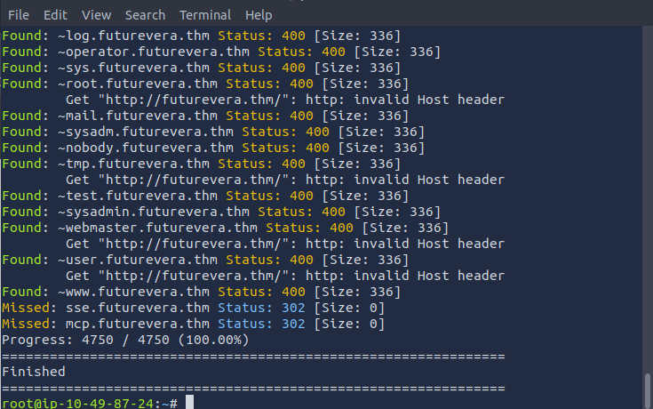

We search for the "Found" results:

```bash
grep Found sub_gob2
```

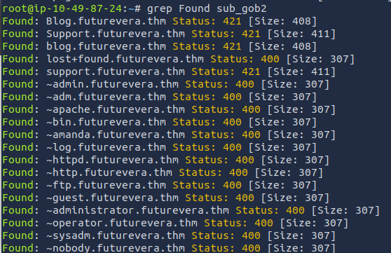

The text seems to hint that this website is for support, so let's try the support subdomain first. We edit the hosts file again:

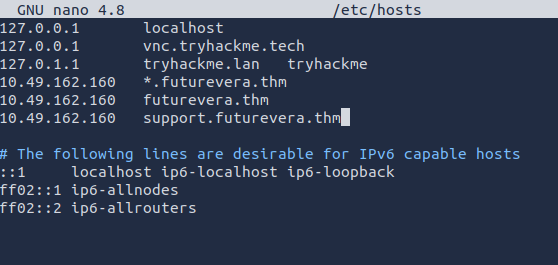

Let's try opening it again:

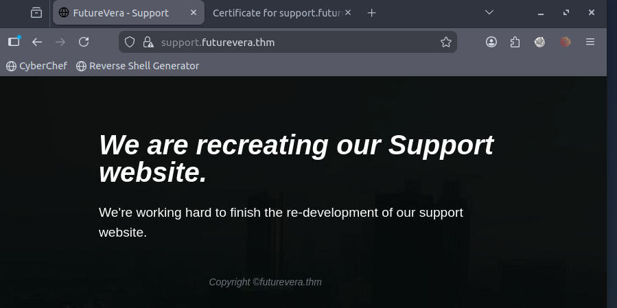

Then we check the certificate to see if there are any insights:

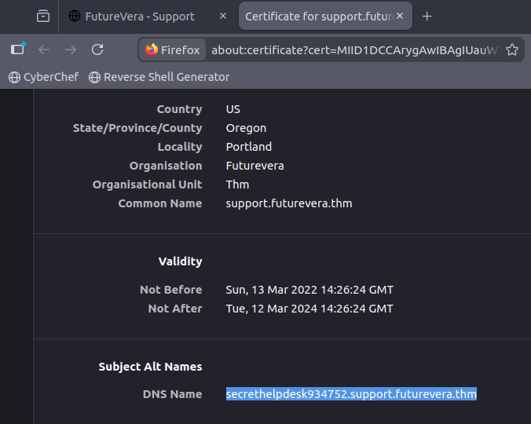

We got a new hint, so let's add it to the hosts file again:

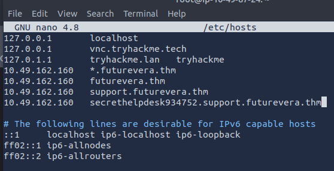

Okay, let's try using curl:

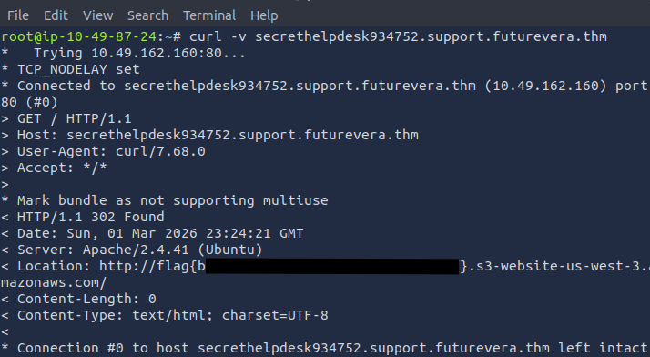

And we got the flag!

Thanks for reading. See you in the next lab.
