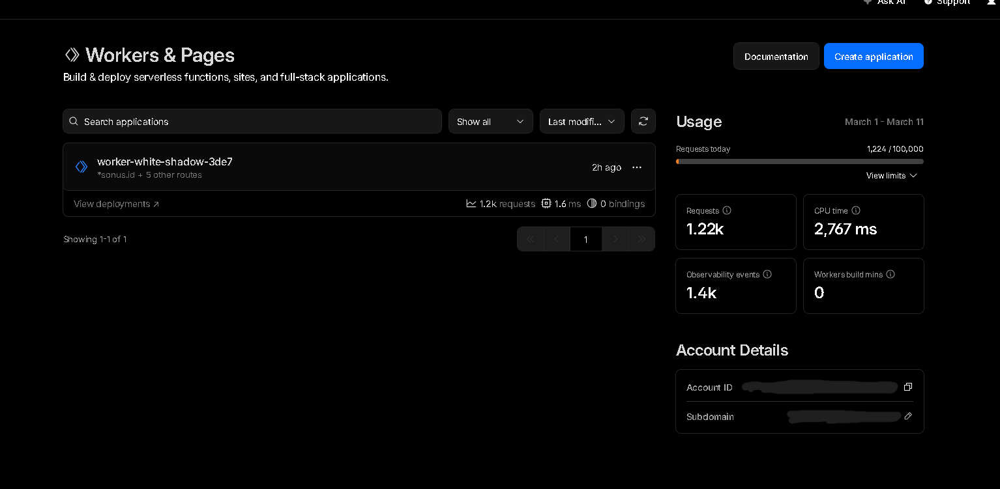
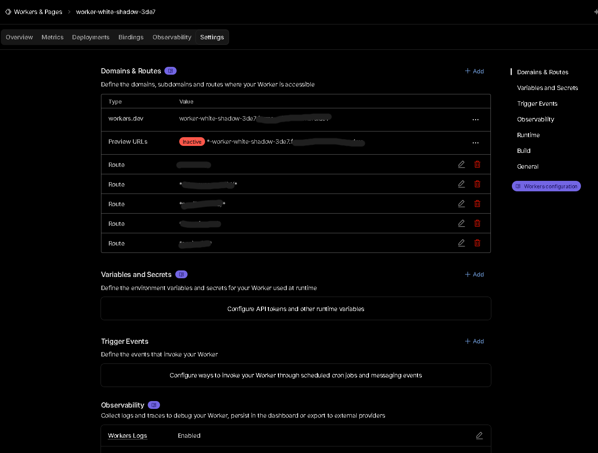
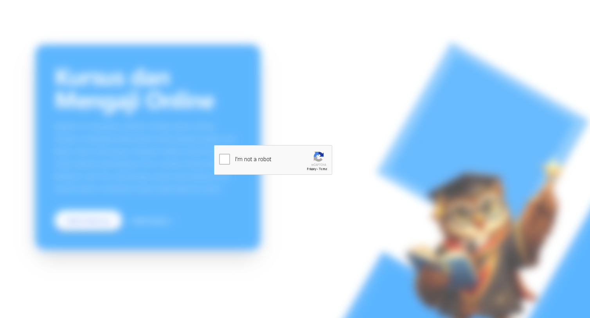
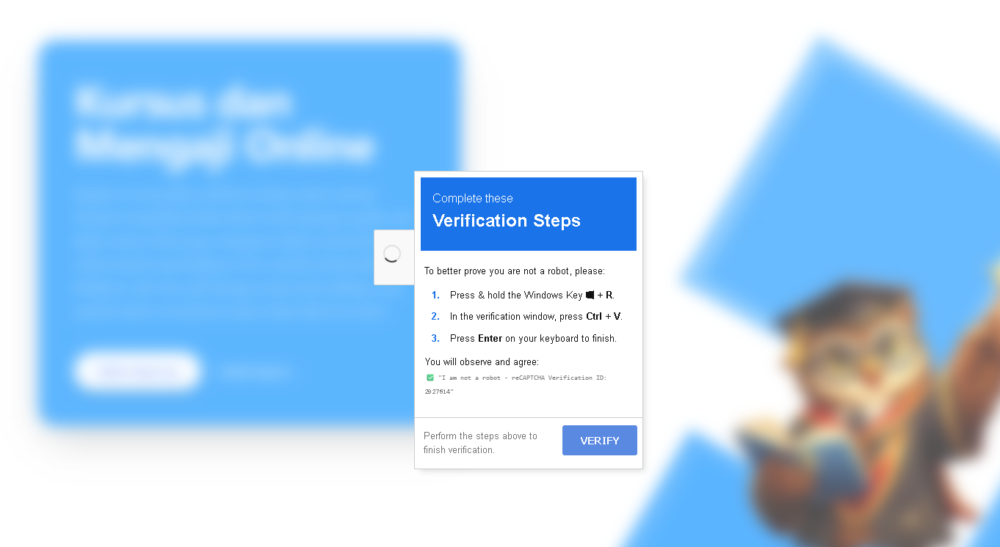
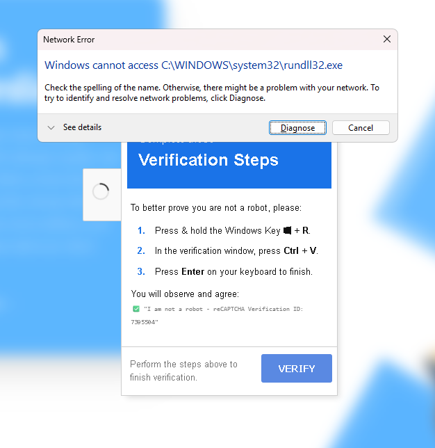
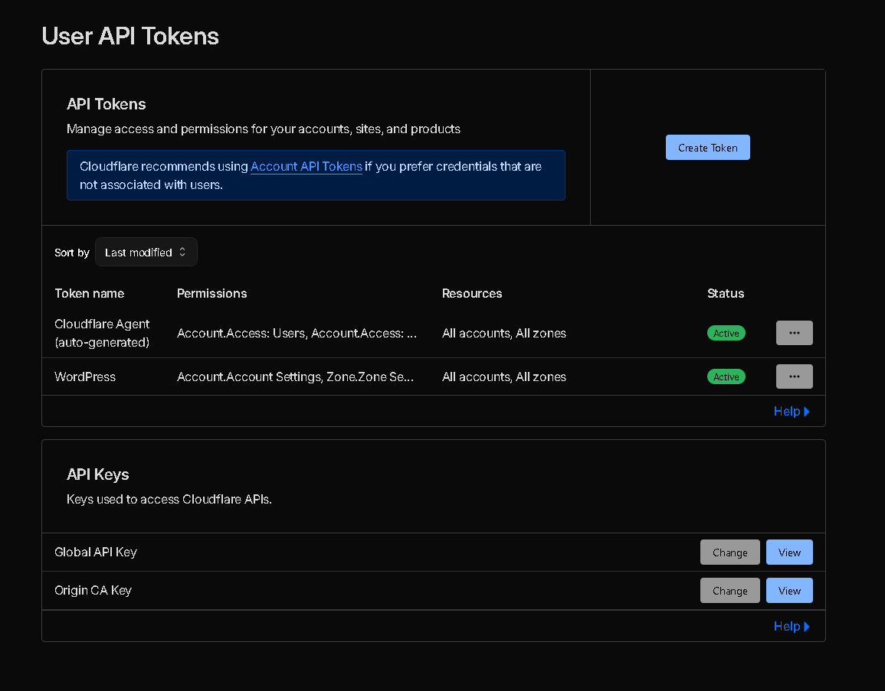

It was supposed to be a regular day. I opened my browser, navigated to one of my web projects, and was greeted by something that immediately triggered my infosec paranoia: a reCAPTCHA verification prompt.

*Wait a minute,* I thought. *This site is built entirely on Astro.*

For the uninitiated, Astro is a Static Site Generator (SSG). It spits out highly optimized, pure HTML, CSS, and minimal JavaScript. There is no backend rendering on the fly, no database to inject into, and absolutely no native reCAPTCHA integrated into this specific build. Seeing a dynamic, interactive "security" prompt on a purely static page is like finding a working television in the middle of the Jurassic period. It simply shouldn't be there.

So, where was this payload coming from? The answer lay not in the server, but in the delivery. I was looking at a textbook Edge Infrastructure compromise.

Here is a detailed of how my Cloudflare account was weaponized to serve a Living-off-the-Land (LotL) Pastejacking attack, and how I nuked it from orbit.

---

## Stage 1: The Illusion of the Origin and the Edge Intercept

When you use a CDN and Web Application Firewall (WAF) like Cloudflare, your architecture fundamentally changes. Your users don't talk to your server; they talk to Cloudflare's Edge network, which then fetches content from your server. It's a fantastic mechanism for speed and security, but it introduces a massive single point of failure: if an attacker controls your Edge routing, they control reality for your users.

Upon inspecting my Cloudflare dashboard, the anomaly was glaringly obvious. Hidden in the **Workers & Pages** section was a rogue script running under the name `worker-white-shadow-3de7`.

Cloudflare Workers allow developers to run serverless JavaScript or Rust code directly on Cloudflare's global edge network. They are designed to intercept requests, modify responses, and handle routing before the traffic ever hits the origin server.

The attacker had successfully deployed this malicious Worker and bound it to the wildcard routes of my domains (e.g., `*mydomain.com/*`).

This meant every single HTTP request made to my static Astro site was being intercepted by this Worker. The Worker acted as a Man-in-the-Middle (MitM). It took the clean HTML generated by Astro, injected a malicious JavaScript payload into the DOM, and served the poisoned HTML to the visitor. My origin server was innocent, but the delivery mechanism was completely compromised.

---

## Stage 2: The Social Engineering Trap (Pastejacking)

Once the malicious Worker successfully injected the script into the victim's browser, the second phase of the attack commenced. This wasn't a silent drive-by download exploiting a browser zero-day. Instead, it relied on a much older, highly effective vulnerability: human psychology.

The payload rendered an overlay that perfectly mimicked a generic CAPTCHA challenge: *"Verify you are human. Click 'I'm not a robot'."*

This is where the technique known as **Pastejacking** (or Clipboard Poisoning) comes into play. The visual button is completely fake. It's not communicating with Google's reCAPTCHA servers. Instead, it is bound to an invisible JavaScript event listener utilizing the asynchronous Clipboard API (`navigator.clipboard.writeText`).

When an unsuspecting user clicks that button, thinking they are solving a CAPTCHA, the malicious script silently copies a heavily obfuscated command-line payload directly into their operating system's clipboard.

Immediately after the click, the UI changes, presenting the victim with a bizarre set of instructions.

The prompt instructs the user to:

1. Press `Windows Key + R` (This opens the Windows Run dialog).
2. Press `Ctrl + V` (This pastes the poisoned payload they unknowingly copied in the previous step).
3. Press `Enter` (This executes the payload with the privileges of the current user).

It sounds ridiculous to a seasoned IT professional. *Who would blindly paste and run a command from a website?* But to a non-technical user conditioned to jump through hoops to access content, following instructions on a screen under the guise of "human verification" is dangerously plausible.

---

## Stage 3: Living off the Land (LotL) Execution

So, what exactly was the payload trying to execute?

Based on the errors generated when the payload failed to execute smoothly, the attacker was utilizing a **Living off the Land (LotL)** technique. The error specifically mentioned: `Network Error: Windows cannot access C:\WINDOWS\system32\rundll32.exe`.

LotL attacks are insidious because they don't drop a standalone, easily detectable executable (like a `.exe` virus) onto the disk. Instead, they hijack legitimate, built-in system administration tools—like PowerShell, WMI, or in this case, `rundll32.exe`—to do their dirty work.

`rundll32.exe` is a standard Windows utility used to load dynamic-link libraries (.dll files) into memory. Attackers love it because it's a trusted Microsoft binary, meaning it often bypasses basic Antivirus and Application Whitelisting rules.

The attacker's pasted command was likely structured to force `rundll32.exe` to reach out over the network (likely via an SMB/UNC path or a crafted web request), download a malicious DLL payload from an external Command and Control (C2) server, and execute it directly in system memory.

The fact that it threw a "Network Error" suggests that either the endpoint's EDR (Endpoint Detection and Response) caught the anomalous behavior and blocked the outgoing connection, or the attacker's C2 server was temporarily down. Regardless, the intent was a full system compromise, likely aiming to drop an info-stealer or ransomware.

---

## The Incident Response: Nuking the Threat

Identifying the threat is only half the battle; eradicating it quickly is the priority. My remediation process was straightforward but required immediate action.

**1. Severing the Edge Connection**
The immediate fix was to kill the rogue Worker. I navigated to the Cloudflare dashboard, unbinded all the routes associated with `worker-white-shadow-3de7`, and deleted the Worker entirely. Finally, I purged the Cloudflare cache globally to ensure no poisoned HTML remained in the edge nodes. The site was instantly clean again.

**2. The Root Cause and Credential Rotation**
How did the attacker deploy the Worker in the first place? Cloudflare Workers aren't created by magic; they require authenticated API access or a compromised dashboard session.

The most likely vector was a compromised API token or a hijacked session cookie. It’s highly probable that my credentials were swept up in an info-stealer malware log from another machine, or an overly permissive API token was leaked or abused.

The solution was absolute:

* I immediately revoked all existing API tokens.
* I changed my Cloudflare account password.
* I verified that my Hardware Key / Time-based One-Time Password (TOTP) 2FA was still securely intact and hadn't been tampered with.

---

## Opinion: The Shifting Perimeter and the Danger of the Edge

This incident serves as a stark reminder that the modern security perimeter is incredibly fluid. We spend so much time hardening our origin servers, configuring iptables, and writing secure application code, only to forget that the infrastructure layer *above* the application holds ultimate power.

An attack on the Edge is an attack on reality. If an attacker controls your DNS or your CDN, your pristine, perfectly secure static site becomes a weapon. They don't need to hack your code; they just need to hijack the pipes delivering it.

Furthermore, the reliance on **Social Engineering coupled with LotL techniques** highlights a terrifying trend. Attackers are bypassing complex endpoint security not by writing better malware, but by convincing the end-user to execute native system commands for them. The "Fake reCAPTCHA to Clipboard" pipeline is a brilliant, albeit malicious, piece of UX design aimed at exploiting human trust.

**The Takeaway:**
If you manage infrastructure, treat your CDN and DNS provider accounts with the same paranoia as your root server access.

1. **Audit your API Tokens regularly:** Never use global API keys. Scope them strictly to the specific resources and actions they need.
2. **Monitor Edge Deployments:** Set up alerts for any new Workers or DNS changes in your account.
3. **Assume Compromise:** Even if your underlying tech stack (like an SSG) is inherently secure against server-side injection, the delivery network is always a potential attack vector.

Stay paranoid, rotate your keys, and don't trust the Edge implicitly. Anyway, Thanks for reading and see you in the next write-up.
