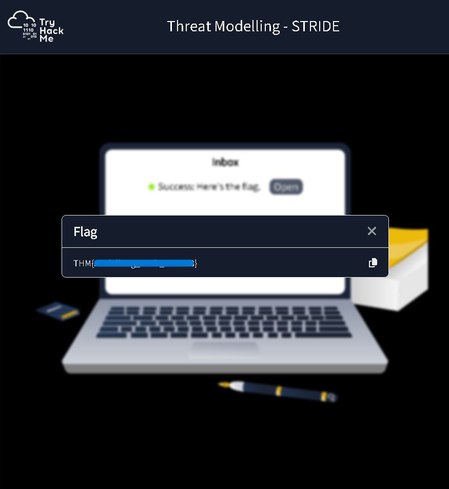

Here i want to share about my write-up for the room [Threat Modelling](https://tryhackme.com/room/capabasics) (Premium Room), building cyber resiliency and emulation capabilities through threat modelling.. I wrote this in 2025 and hope it is useful for learning about cybersecurity.

## Task 1: Introduction

Threat modelling is a proactive approach to identifying vulnerabilities, prioritising threats, and implementing security measures to safeguard critical assets. In the modern cyber security landscape, relying solely on reactive measures is insufficient against sophisticated threat actors.

**Learning Objectives:**

* Understand the significance of threat modelling for organisational resiliency.
* Learn the fundamentals of modelling significant threats.
* Explore frameworks such as **MITRE ATT&CK**, **DREAD**, **STRIDE**, and **PASTA**.

**Prerequisites:**
It is recommended to have knowledge of Threat Emulation and Principles of Security before starting this module.

**Let's start modelling threats!**

> No answer needed

---

## Task 2: Threat Modelling Overview

**What is Threat Modelling?**
It is a systematic approach to identifying, prioritising, and addressing potential security threats. By simulating attack scenarios and assessing vulnerabilities, organisations can reduce risk exposure and allocate resources effectively.

**Key Definitions (The "House" Analogy):**

* **Threat:** Potential occurrence or actor (e.g., a burglar).
* **Vulnerability:** A weakness or flaw (e.g., broken locks).
* **Risk:** The likelihood of compromise (e.g., living in a high-crime area).

**High-Level Process:**

1. **Define Scope:** Identify systems/networks.
2. **Asset Identification:** Diagram architecture and identify critical data.
3. **Identify Threats:** pinpoint potential attacks (cyber, physical, social engineering).
4. **Analyse Vulnerabilities & Prioritise Risks:** Assess impact and likelihood.
5. **Countermeasures:** Design and implement controls.
6. **Monitor & Evaluate:** Continuously test effectiveness.

**Attack Trees:**

An attack tree is a graphical representation used to analyse threats. The root node represents the attacker's goal (e.g., "Gain unauthorised access"), while branches represent the techniques and paths used to achieve that goal.

**What is a weakness or flaw in a system, application, or process that can be exploited by a threat?**

> vulnerability

**Based on the provided high-level methodology, what is the process of developing diagrams to visualise the organisation's architecture and dependencies?**

> Asset Identification

**What diagram describes and analyses potential threats against a system or application?**

> attack tree

---

## Task 3: Modelling with MITRE ATT&CK

**The Framework:**
The **MITRE ATT&CK** (Adversarial Tactics, Techniques, and Common Knowledge) framework is a global knowledge base of adversary behaviour. It is organised into a matrix of **Tactics** (high-level objectives) and **Techniques** (methods used).

**Components of a Technique Page:**

* **Description:** Details of the technique.
* **Procedure Examples:** Real-world usage by threat actors.
* **Mitigations:** Recommended security measures.
* **Detections:** Strategies/indicators to identify the technique.

**Integration into Threat Modelling:**
MITRE ATT&CK is mapped after the "Identify Threats" phase. By mapping threats to specific ATT&CK techniques, security teams can derive specific mitigations and detection strategies. It aids in developing threat scenarios, identifying attack paths, and prioritising vulnerability remediation based on real-world threat group data.

**What is the technique ID of "Exploit Public-Facing Application"?**

> T1190

**Under what tactic does this technique belong?**

> Initial Access

---

## Task 4: Mapping with ATT&CK Navigator

**ATT&CK Navigator:**
This is an open-source, web-based tool designed to visualise and navigate the MITRE ATT&CK matrix. It allows users to create custom layers to map techniques relevant to their specific environment.

**Key Features:**

* **Selection Controls:** Search and select techniques by keywords, threat groups (e.g., APT41), or software.
* **Layer Controls:** Filter by platform (Windows, Linux, etc.), sort, and export data (JSON, Excel, SVG).
* **Technique Controls:** Annotate specific techniques with scores, background colours, comments, and metadata to highlight risks.

**Scenario:**
In a financial services context using GCP and web apps, an analyst can map threat groups like APT28 or FIN7 to the matrix. This helps prioritise critical vulnerabilities such as *Exploit Public-Facing Application (T1190)* or *Data from Cloud Storage (T1530)*.

**How many MITRE ATT&CK techniques are attributed to APT33?**

> 31

**Upon applying the IaaS platform filter, how many techniques are under the Discovery tactic?**

> 13

---

## Task 5: DREAD Framework

**Overview:**
Developed by Microsoft, **DREAD** is a risk assessment model used for qualitative risk analysis. It prioritises threats based on the average score (1-10) of five categories.

**The DREAD Categories:**

* **Damage:** How bad would the attack be? (e.g., data loss, downtime).
* **Reproducibility:** How easy is it to reproduce the attack?
* **Exploitability:** How much work/skill is required to launch the attack?
* **Affected Users:** How many people are impacted?
* **Discoverability:** How easy is it to find the vulnerability?

**Guidelines:**
To reduce subjectivity, organisations should establish standardised scoring definitions, encourage team collaboration for scoring justification, and use DREAD alongside other methodologies.

**What DREAD component assesses the potential harm from successfully exploiting a vulnerability?**

> Damage

**What DREAD component evaluates how others can easily find and identify the vulnerability?**

> Discoverability

**Which DREAD component considers the number of impacted users when a vulnerability is exploited?**

> Affected Users

---

## Task 6: STRIDE Framework

**Overview:**
**STRIDE** is a threat modelling methodology used primarily in software development and system design. It identifies threats by categorising them into six types, each violating a specific aspect of the **CIA Triad** (Confidentiality, Integrity, Availability) or related security policies.

**The Categories:**

1. **Spoofing:** Impersonating a user/system (Violates: Authentication).
2. **Tampering:** Modifying data/code (Violates: Integrity).
3. **Repudiation:** Denying actions due to lack of logging (Violates: Non-repudiation).
4. **Information Disclosure:** Unauthorised access to data (Violates: Confidentiality).
5. **Denial of Service:** Disrupting availability (Violates: Availability).
6. **Elevation of Privilege:** Gaining unauthorised access levels (Violates: Authorisation).

**Implementation:**
The process involves decomposing the system, applying STRIDE categories to each component, assessing the risk, and developing specific countermeasures (e.g., using DMARC to prevent email spoofing).

**What foundational information security concept does the STRIDE framework build upon?**

> CIA Triad

**What policy does Information Disclosure violate?**

> Confidentiality

**Which STRIDE component involves unauthorised modification or manipulation of data?**

> Tampering

**Which STRIDE component refers to the disruption of the system's availability?**

> Denial of Service

Insecure web application search functionality leading to SQL injection.

* Tampering
* Information Disclosure

Insecure AWS Infrastructure (EC2, S3, RDS) without load balancers.

* Information Disclosure
* Denial of Service

Mail server with no logging enabled.

* Spoofing

Unpatched employee workstations.

* Tampering
* Elevation of Privilages

**Provide the flag for the simulated threat modelling exercise.**

> THM{_}

---

## Task 7: PASTA Framework

**Overview:**
**PASTA** (Process for Attack Simulation and Threat Analysis) is a risk-centric, seven-step framework. It aligns threat modelling with business objectives and technical requirements.

**The Seven-Step Methodology:**

1. **Define Objectives:** Establish scope and compliance requirements.
2. **Define Technical Scope:** Inventory assets and understand architecture.
3. **Decompose Application:** Map data flows, trust boundaries, and components.
4. **Analyse Threats:** Identify threat sources (internal/external).
5. **Vulnerabilities Analysis:** Scan for weaknesses (static analysis, pentesting).
6. **Analyse Attacks:** Simulate attack scenarios to verify risks.
7. **Risk and Impact Analysis:** Develop countermeasures based on risk tolerance.

**Benefits:**
PASTA is highly adaptable, fosters collaboration between developers/architects/business stakeholders, and ensures security efforts directly support business goals.

**In which step of the framework do you break down the system into its components?**

> Decompose the Application

**During which step of the PASTA framework do you simulate potential attack scenarios?**

> Analyse the Attacks

**In which step of the PASTA framework do you create an inventory of assets?**

> Define the Technical Scope

### Process Flow Diagram

1. **Strategic Planning**
2. **System Architecture**
3. **Software Development**
4. **Information Security**
5. **Strategic Planning**

---

### Quiz Questions and Answers

What should be the top priority for the online banking platform, as mentioned by the Business Analyst?

> Protecting customers’ personal and financial data, securing transactions, and ensuring service availability.

According to the System Architect, what are the primary technical assets of the online banking system?

> Amazon EC2, RDS, and S3 services

What components of the application did the Lead Developer highlight during the 'Decompose the Application' phase?

> User registration, account management, fund transfers, bill payments, and account statements

According to the Security Engineer, which type of threat is NOT considered for the online banking platform?

> Social engineering attacks

Which vulnerability was mentioned by the Security Engineer as a potential issue for the online banking platform?

> Cloud Infrastructure Misconfigurations

According to the Security Engineer, which mitigation strategy does match the identified threats?

> Account lockouts

In the "Risk and Impact Analysis" phase, what potential consequence of a successful attack was mentioned by the Business Analyst?

> Financial loss and significant reputational damage

**Provide the flag for the simulated threat modelling exercise.**

> THM{_}

---

## Task 8: ConclusionWe have covered four distinct frameworks, each with unique applications

* **MITRE ATT&CK:** Best for mapping real-world adversary tactics and testing existing controls.
* **DREAD:** Best for numerical prioritisation of risks based on damage and exploitability.
* **STRIDE:** Best for software development, focusing on categorising threats (Spoofing, Tampering, etc.).
* **PASTA:** Best for a holistic, risk-centric approach that aligns with business objectives.

Leveraging these frameworks helps enhance threat awareness, prioritise mitigation, and improve overall organisational resilience.

**I have completed the Threat Modelling room.**

> No answer needed
