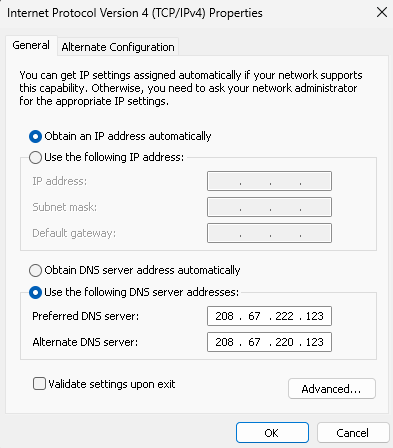
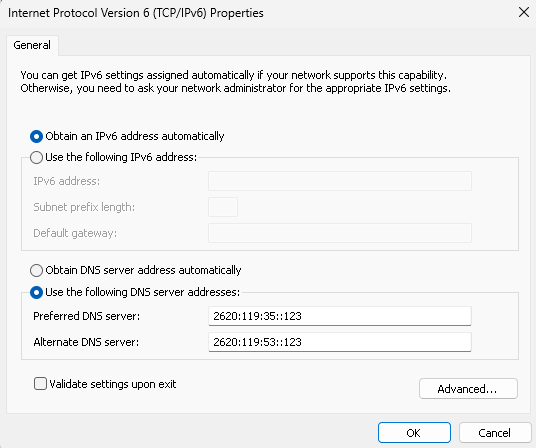
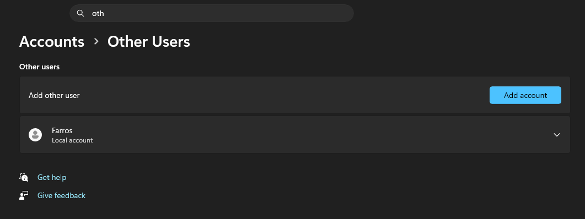
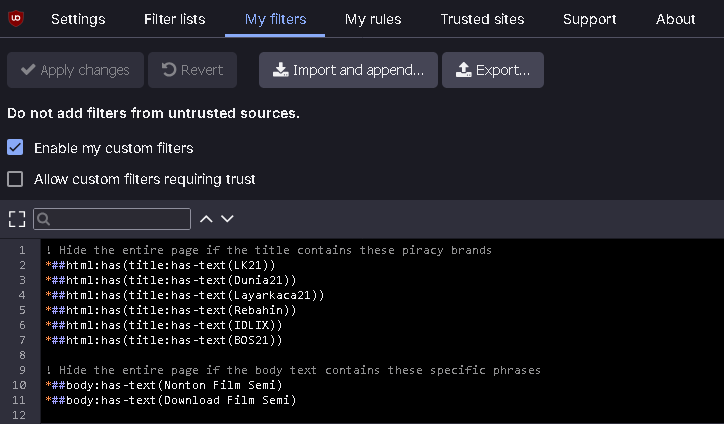

Technology is a double-edged sword; while it has the power to empower and connect us, it can also be a tool for destruction. I am sharing this hardening method to combat the proliferation of content that is dangerous to our society—specifically explicit and harmful adult content—in an effort to protect and build a better generation.

When hardening a system against such content, a single layer is never enough. This guide uses a Red Teaming "Defense in Depth" approach to ensure filtering remains active even if the user tries to bypass it.

## Why OpenDNS FamilyShield?

Before settling on this setup, I researched several major DNS providers focused on family safety:

- **Cloudflare Family (1.1.1.3):** Fast and reliable, but sometimes lacks the granular strictness needed for deep content filtering.
- **CleanBrowsing:** Highly effective, but some advanced features are locked behind a subscription.
- **NextDNS:** Excellent customization and analytics. However, their free tier is limited to **300,000 queries per month**, which is often insufficient for a busy home or office environment, leading to filtered traffic being allowed once the limit is hit.

I chose **OpenDNS FamilyShield** because it is completely free, requires zero configuration to start blocking adult content (no custom IDs or links needed), and is incredibly strict by default. It provides a robust "set and forget" foundation for our hardening layers.

## Layer 1: The Network Perimeter (Router)

The first line of defense is your gateway. By setting DNS at the router level, every device on the network is protected by default.

**How to do it:** Log into your router's admin panel (usually `192.168.1.1`). Find the **DHCP** or **Internet** settings and set the DNS servers to OpenDNS FamilyShield:

- **IPv4:** `208.67.222.123` and `208.67.220.123`
- **IPv6:** `2620:119:35::123` and `2620:119:53::123`

## Layer 2: The OS Adapter Layer

Even if the router is bypassed, the Windows network adapter acts as a secondary filter.





Run this in PowerShell as Admin to force system-wide DNS. You have two options:

### Option A: Active Adapters Only (Standard)

Use this if you only want to affect the connection you are currently using.

```powershell
$dnsIpv4 = @("208.67.222.123", "208.67.220.123")
$dnsIpv6 = @("2620:119:35::123", "2620:119:53::123")

$adapters = Get-NetAdapter | Where-Object { $_.Status -eq "Up" }
foreach ($adapter in $adapters) {
    Set-DnsClientServerAddress -InterfaceAlias $adapter.Name -ServerAddresses $dnsIpv4
    Set-DnsClientServerAddress -InterfaceAlias $adapter.Name -ServerAddresses $dnsIpv6 -ErrorAction SilentlyContinue
}
Clear-DnsClientCache
```

### Option B: Full Hardening (All Adapters)

Recommended for laptops. This ensures that even if you switch from Wi-Fi to Ethernet later, the protection remains active.

```powershell
$dnsIpv4 = @("208.67.222.123", "208.67.220.123")
$dnsIpv6 = @("2620:119:35::123", "2620:119:53::123")

Get-NetAdapter | Set-DnsClientServerAddress -ServerAddresses $dnsIpv4
Get-NetAdapter | Set-DnsClientServerAddress -ServerAddresses $dnsIpv6 -ErrorAction SilentlyContinue
Clear-DnsClientCache
```

## Layer 3: The Browser Layer (Policy Hardening)

Modern browsers often use **DNS over HTTPS (DoH)**, which can bypass both Router and Adapter settings. We use Windows Registry Policies to lock the browser into a secure DoH provider and prevent the user from disabling it.

### Firefox

```powershell
Stop-Process -Name firefox -Force -ErrorAction SilentlyContinue
$path = "HKLM:\SOFTWARE\Policies\Mozilla\Firefox\DNSOverHTTPS"
if (!(Test-Path $path)) { New-Item -Path $path -Force | Out-Null }

Set-ItemProperty -Path $path -Name "Enabled" -Value 1 -Type DWord
Set-ItemProperty -Path $path -Name "Locked" -Value 1 -Type DWord
Set-ItemProperty -Path $path -Name "ProviderURL" -Value "https://doh.familyshield.opendns.com/dns-query" -Type String
Write-Host "Firefox DNS is now locked to OpenDNS." -ForegroundColor Green
```

### Chrome, Edge, Brave, & Opera (Chromium-based)

Most modern browsers are Chromium-based and share similar policy structures, but they use different Registry paths. Run these to lock DoH for your preferred browser:

```powershell
# Define the DNS settings
$dohMode = "secure"
$dohTemplate = "https://doh.familyshield.opendns.com/dns-query"

# Registry Paths for different browsers
$paths = @(
    "HKLM:\SOFTWARE\Policies\Google\Chrome",        # Chrome
    "HKLM:\SOFTWARE\Policies\Microsoft\Edge",      # Edge
    "HKLM:\SOFTWARE\Policies\BraveSoftware\Brave", # Brave
    "HKLM:\SOFTWARE\Policies\Vivaldi",             # Vivaldi
    "HKLM:\SOFTWARE\Policies\Opera"                # Opera
)

foreach ($path in $paths) {
    if (!(Test-Path $path)) { New-Item -Path $path -Force | Out-Null }
    Set-ItemProperty -Path $path -Name "DnsOverHttpsMode" -Value $dohMode -Type String
    Set-ItemProperty -Path $path -Name "DnsOverHttpsTemplates" -Value $dohTemplate -Type String
}

Write-Host "Chromium-based browsers are now locked to OpenDNS." -ForegroundColor Green
```

## Layer 4: Content & Search Enforcement (Hosts)

We can force "SafeSearch" at the IP level by modifying the `hosts` file. This prevents users from seeing explicit results even on "clean" search engines. We also block "Proxy Search Engines" like Startpage, which can be used to bypass DNS filters via their "Anonymous View" feature.

```bash
# Google & YouTube SafeSearch
216.239.38.120 www.google.com
216.239.38.120 google.com
216.239.38.120 www.youtube.com
216.239.38.120 m.youtube.com

# Bing SafeSearch
204.79.197.220 www.bing.com

# DuckDuckGo SafeSearch
52.149.246.39 safe.duckduckgo.com

# Brave SafeSearch
# (Note: Brave uses its own indexing, but blocking specific domains can help)
0.0.0.0 search.brave.com # Optional: Block if you want to force Google/Bing SafeSearch

# Startpage (Proxy Bypass)
# Startpage's "Anonymous View" acts as a web proxy, bypassing DNS filters.
0.0.0.0 startpage.com
0.0.0.0 www.startpage.com
0.0.0.0 s7.startpage.com
```

## Layer 5: Privilege Management (The Lock)

The most critical layer. All the settings above can be reversed if the user has Administrative privileges. By switching to a **Standard User** account, the user cannot modify the Registry, the Hosts file, or Network Adapter settings.



**Security Note:** For this "Lock" to be effective, your primary Administrative account must have a strong password that the Standard User does not know. This prevents the user from using "Run as Administrator" to bypass your policies.

This final step also prevents the installation of **VPNs, Proxies, or Portable Browsers** that could tunnel traffic past our DNS filters. Since a Standard User cannot install new network drivers, they are effectively locked into the hardened environment.

## Layer 6: The Firewall Layer (IP Blocking)

DNS filtering only blocks domain names. If a site uses a direct IP address (like many movie piracy sites), you must block the "number" itself using the Windows Firewall. Many movie piracy sites are notorious for serving adult advertisements or even hosting explicit adult content directly, making IP-level blocking essential for a clean environment.

```powershell
# Block specific malicious IPs directly
New-NetFirewallRule -DisplayName "Block Malicious IPs" `
    -Direction Outbound `
    -Action Block `
    -RemoteAddress "162.244.93.0/24", "195.63.129.0/24", "139.59.72.0/24", "167.71.201.0/24", "139.59.34.0/24", "165.232.170.0/24", "146.190.87.0/24", "129.212.208.0/24","159.203.161.0/24","165.245.144.0/24","143.110.182.0/24","154.93.72.0/24","159.223.73.0/24"
```

Since the user is a **Standard User (Layer 5)**, they cannot modify or delete these firewall rules.

## Layer 7: Real-time Content Scanning (Keyword Blocking)

Even with DNS and IP blocks, some sites might slip through or be dynamic. We can implement real-time content scanning at the browser level to block the entire page if specific keywords or phrases are found.

### Option A: uBlock Origin (Static Blocking)

Using a browser extension like **uBlock Origin**, you can implement real-time content scanning. The keywords below are common title markers for popular piracy websites that often serve "semi-adult" content.



Add these to your "My filters" tab in uBlock Origin:

```text
! Hide the entire page if the title contains these piracy brands
*##html:has(title:has-text(LK21))
*##html:has(title:has-text(Dunia21))
*##html:has(title:has-text(Layarkaca21))
*##html:has(title:has-text(Rebahin))
*##html:has(title:has-text(IDLIX))
*##html:has(title:has-text(BOS21))

! Hide the entire page if the body text contains these specific phrases
*##body:has-text(Nonton Film Semi)
*##body:has-text(Download Film Semi)
```

### Option B: Tampermonkey (Advanced Redirects)

For a more "educational" approach, you can use **Tampermonkey** to redirect the user to a specific video (e.g., a security awareness video) when a violation is detected. This method allows for complex logic, such as excluding trusted domains like Google or your own workspace.

Create a new script in Tampermonkey and paste the following:

```javascript
// ==UserScript==
// @name         Redirect Piracy Sites by Content
// @namespace    http://tampermonkey.net/
// @version      1.1
// @description  Redirects the page to YouTube if specific piracy brands or text are found.
// @match        *://*/*
// @exclude      *://*.farros.co/*
// @exclude      *://farros.co/*
// @exclude      *://*.medium.com/*
// @exclude      *://medium.com/*
// @exclude      *://*.google.com/*
// @exclude      *://google.com/*
// @exclude      *://*.youtube.com/*
// @exclude      *://youtube.com/*
// @grant        none
// @run-at       document-idle
// ==/UserScript==

(function() {
    'use strict';

    // The YouTube URL you want to redirect to
    const targetURL = "https://www.youtube.com/watch?v=fbTlW1V2VuI&t=2726s";

    // Regex for titles
    const badTitles = [
        /lk21/i, /dunia21/i, /layarkaca21/i, /rebahin/i, /idlix/i, /bos21/i, /indoxx1/i
    ];

    // Regex for body text
    const badText = [
        /nonton film semi/i, /download film semi/i
    ];

    let shouldRedirect = false;

    // Check document title
    if (document.title && badTitles.some(regex => regex.test(document.title))) {
        shouldRedirect = true;
    }

    // Check body text
    if (!shouldRedirect && document.body) {
        const pageText = document.body.innerText || document.body.textContent;
        if (badText.some(regex => regex.test(pageText))) {
            shouldRedirect = true;
        }
    }

    // Redirect to YouTube if a match is found
    if (shouldRedirect) {
        // Clear the page instantly to hide the content while the redirect happens
        document.documentElement.innerHTML = '<h1 style="text-align:center; margin-top:20%; font-family:sans-serif;">Redirecting to Educational Content...</h1>';
        window.location.replace(targetURL);
    }
})();
```

This ensures that even if a new domain appears, if it uses the same branding or content markers, it will be instantly hidden and redirected.

## Layer 8: Extension Persistence (The Force Install)

Layer 7 is only effective if the uBlock Origin extension remains active. A savvy user might try to disable or uninstall the extension to bypass your keyword filters. We can use Windows Registry policies to "force-install" the extension, making it impossible for a Standard User to remove or disable it from the browser settings.

Run this in PowerShell as Admin to lock uBlock Origin into Firefox:

```powershell
# Create the Extension Settings policy path
$firefoxPolicyPath = "HKLM:\SOFTWARE\Policies\Mozilla\Firefox\ExtensionSettings"
if (!(Test-Path $firefoxPolicyPath)) { New-Item -Path $firefoxPolicyPath -Force | Out-Null }

# Force-install uBlock Origin and prevent removal
$uBlockConfig = '{"installation_mode":"force_installed","install_url":"https://addons.mozilla.org/firefox/downloads/latest/ublock-origin/latest.xpi"}'
Set-ItemProperty -Path $firefoxPolicyPath -Name "uBlock0@raymondhill.net" -Value $uBlockConfig
```

Once applied, the "Remove" and "Disable" buttons for uBlock Origin in Firefox will be hidden or greyed out, and the extension will be automatically re-installed if the browser profile is refreshed.

---

## Minimal Implementation (One-Click)

For those who want to apply these hardening layers quickly, I have created a consolidated PowerShell script that automates Layers 2, 3, 4, and 6 in one go. You can find the full source code and documentation in my GitHub repository: [farrosfr/noa](https://github.com/farrosfr/noa).

**To run the hardening script instantly, open PowerShell as Administrator and paste the following command:**

```powershell
irm https://raw.githubusercontent.com/farrosfr/noa/main/harden.ps1 | iex
```

*Note: Always review scripts from the internet before running them. This script will modify your DNS settings, Registry policies, and Firewall rules to enforce strict content filtering.*

---

## How to Verify Your Setup

Once you've applied all layers, perform these tests to ensure your "Defense in Depth" is active:

1. **OpenDNS Welcome Page:** Visit [welcome.opendns.com](https://welcome.opendns.com). You should see a message saying: *"Welcome to OpenDNS! Your internet is safer, faster, and smarter."*
2. **The "Blocked" Test:** Try to visit a known adult site. You should be greeted by the OpenDNS "This site is blocked" page.
3. **The Browser Lock:** Open your browser's DNS settings. You should see a message stating: *"Your browser is managed by your organization"* and the option to change DNS settings should be disabled (greyed out).

---

## Red Team Insight: The Defense in Depth Structure

As a Red Teamer, I approach security by looking for the "weakest link." A single filter is just a hurdle; a multi-layered defense is a wall. This guide follows a **Defense in Depth (DiD)** structure designed to fail-safe:

1. **Perimeter (Router):** The first line of defense. It catches every device on the network before they even reach the OS.
2. **System (Adapter):** If a device leaves the network or uses a VPN that doesn't leak DNS, the OS-level adapter settings act as a secondary guard.
3. **Application (Browser Policy):** Many modern threats (and bypasses) happen at the application layer. By using Registry Policies, we force the browser to obey the rules, even if the user tries to toggle settings in the UI.
4. **Content (Hosts):** We target the specific content delivery method (Search Engines) to ensure that even "clean" sites don't serve explicit results.
5. **Privilege (Standard User):** The ultimate lock. In security, **Identity and Access Management (IAM)** is king. Without Admin rights, the user cannot tear down the other four layers.
6. **Active Content Inspection (Keyword Blocking):** The final safeguard. By scanning the DOM in real-time, we can block pages that bypass domain and IP filters but still contain known harmful keywords or branding.

By layering these controls, you create a system where the "cost of bypass" is higher than the user's technical ability or patience.
