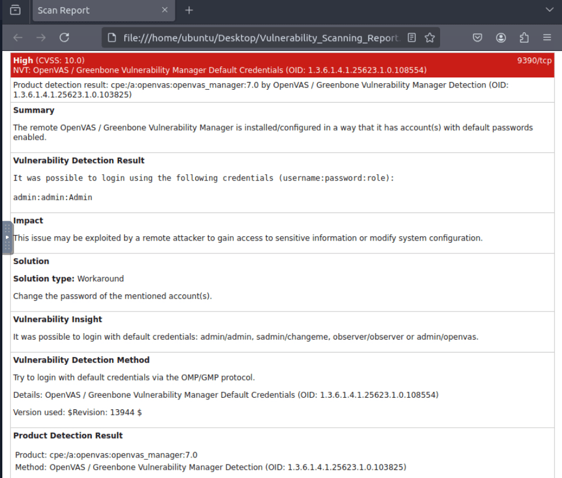

Here i want to share about my write-up for the room [Vulnerability Scanner Overview](https://tryhackme.com/room/idsfundamentals) (Premium Room), learn about vulnerability scanners and how they work in a practical scenario. I wrote this in 2025 and hope it is useful for learning about cybersecurity.

## Task 1: What Are Vulnerabilities?

Vulnerabilities are weaknesses in software or hardware, similar to small holes in a roof. The process of fixing these vulnerabilities is known as **Patching**.

What is the process of fixing the vulnerabilities called?
>Patching

## Task 2: Vulnerability Scanning

The major categorizations of these scans are:

- **Authenticated vs. Unauthenticated Scans**: Authenticated scans require the subject host's credentials and are more detailed. Unauthenticated scans are conducted without providing any credentials and help identify the threat surface from outside the host.
- **Internal vs. External Scans**: Internal scans are conducted from inside the network, while external scans are conducted from outside the network.

Which type of vulnerability scans require the credentials of the target host?
>authenticated

Which type of vulnerability scan focuses on identifying the vulnerabilities that can be exploited from outside the network?
>External

## Task 3: Tools for Vulnerability Scanning

Here's some of widely used vulnerability scanners.

- **Nessus**: It is a proprietary software with extensive vulnerability scanning options, widely used by large enterprises. Nessus needs to be deployed and managed on-premises.
- **Qualys**: A subscription-based vulnerability management solution. The best thing about Qualys is that it is a cloud-based platform.
- **Nexpose**: A subscription-based solution that continuously discovers new assets and performs vulnerability scans. It offers both on-premises and hybrid deployment modes.
- **OpenVAS**: An open-source vulnerability assessment solution that offers basic features. It is beneficial for small organizations and individual systems.

Almost all vulnerability scanners offer reporting capabilities. They generate a detailed report after every scan containing a list of the vulnerabilities discovered, their risk scores, and detailed descriptions. When choosing a suitable scanner, you must consider the scope, resources, and depth of analysis.

Is Nessus currently an open-source vulnerability scanner? (Yea/Nay)
>Nay

Which company developed the Nexpose vulnerability scanner?
>Rapid7

What is the name of the open-source vulnerability scanner developed by Greenbone Security?
>OpenVAS

## Task 4: CVE & CVSS

**CVE (Common Vulnerabilities and Exposures)** is a unique number given to vulnerabilities. Whenever a new vulnerability is discovered in any software application, it is given a unique CVE number as a reference and published online in a CVE database. A CVE number has the prefix “CVE”, the year it was discovered, and four or more arbitrary digits.

**CVSS (Common Vulnerability Scoring System)** is a score that tells the severity of a vulnerability. The CVSS score is calculated by considering multiple factors, including its impact and ease of exploitability. The severity levels as per the CVSS scores are:

- **Low**: 0.0-3.9
- **Medium**: 4.0-6.9
- **High**: 7.0-8.9
- **Critical**: 9.0-10

CVE stands for?
>Common Vulnerabilities and Exposures

Which organization developed CVE?
>MITRE Corporation

What would be the severity level of the vulnerability with a score of 5.3?
>Medium

## Task 5: OpenVAS

OpenVAS is a complete open-source vulnerability scanner.

What is the IP address of the machine scanned in this task?
>10.10.154.44

How many vulnerabilities were discovered on this host?
>13

## Task 6: Practical Exercise

What is the score of the single high-severity vulnerability found in the scan?
>10

What is the solution suggested by OpenVAS for this vulnerability?
>Change the password of the mentioned account(s).
