This is my write-up for the Walking An Application room on TryHackMe:  
<https://tryhackme.com/room/walkinganapplication>  

In this challenge, we manually explore a web application using browser developer tools such as View Source, Inspector, Debugger, and Network to uncover hidden flags and understand how the application works behind the scenes.

## Task 1: Walking An Application

This task introduces how to manually review a web application for security vulnerabilities using the built-in developer tools in modern browsers. Manual testing is crucial because automated security scanners often miss subtle vulnerabilities and valuable hidden information. The primary browser tools utilized in this process are View Source, Inspector, Debugger, and Network.

**I confirm that I have deployed the virtual machine and opened the website.**

> No answer needed

---

## Task 2: Exploring The Website

Exploring a web application as a penetration tester involves hunting for interactive features (like forms or logins) that could be vulnerable. The most effective way to start is by manually browsing the site and documenting the structure. This includes noting down all discovered URLs, individual pages, and writing a brief summary of the features and functionalities found on each page.

**Read the above.**

> No answer needed

---

## Task 3: Viewing The Page Source

The page source contains the raw HTML, CSS, and JavaScript returned by the server. Analyzing the human-readable source code can reveal sensitive information that isn't visibly displayed on the webpage. Common discoveries include developer comments containing notes or temporary links, hidden directories, misconfigured directory listings exposing backup files, and framework version numbers that might indicate the use of outdated, vulnerable software.


First, we open the website.

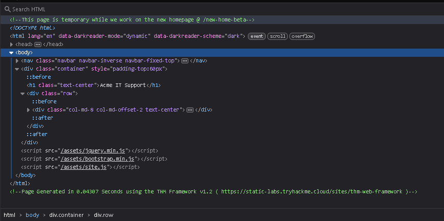

From the HTML source, we discover a path: `/new-home-beta`.

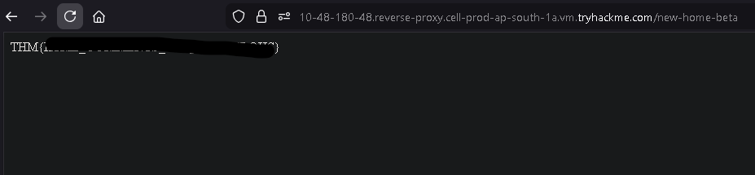

Inside the HTML comments, we find the first flag.

**What is the flag from the HTML comment?**

> THM{REDACTED}

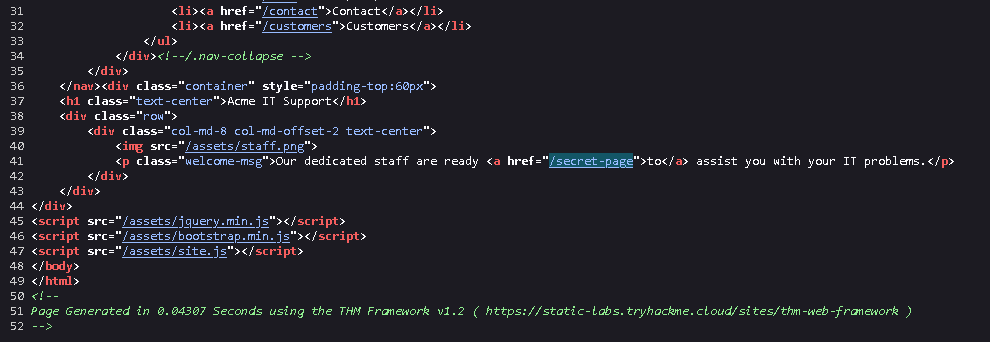

Next, we discover another hidden path: `/secret-page`.

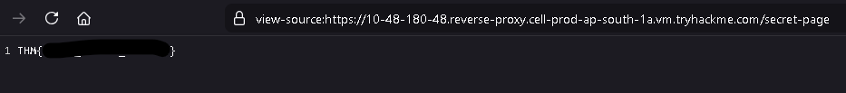

Visiting that page reveals the second flag.

**What is the flag from the secret link?**

> THM{REDACTED}

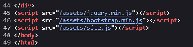

At the bottom of the HTML source, we notice a reference to a directory path: `/assets`.  
We then try accessing that directory directly.

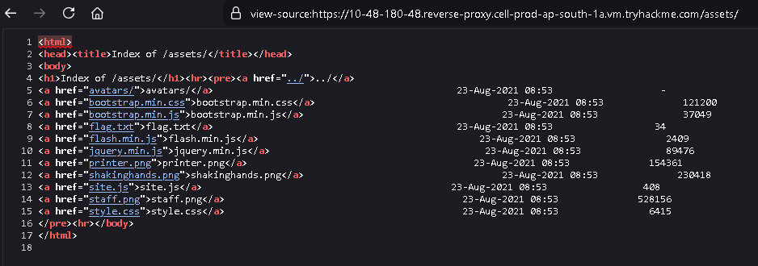

From the directory listing, we obtain the third flag.

**What is the directory listing flag?**

> THM{REDACTED}

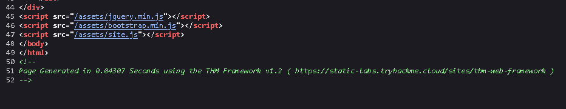

At the very bottom, we also see a URL pointing to the web framework:  
<https://static-labs.tryhackme.cloud/sites/thm-web-framework>

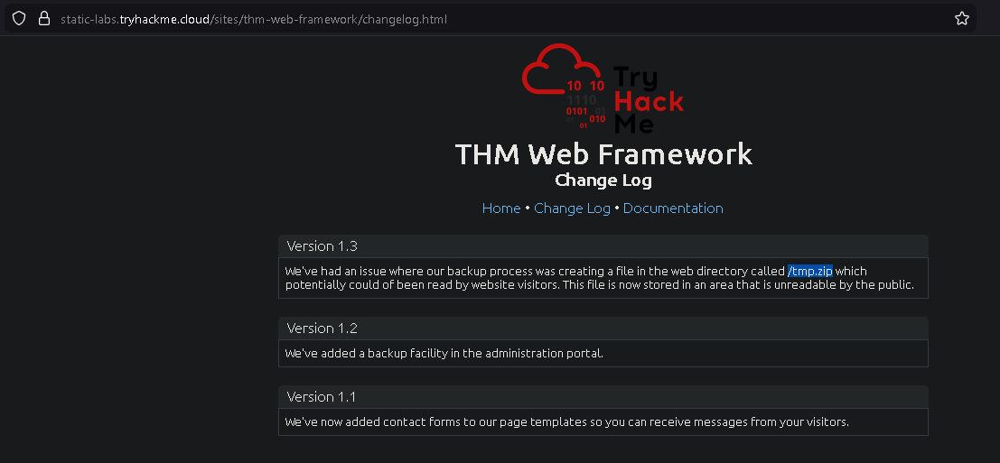

Inside the changelog section, we discover a new path: `/tmp.zip`, which we can further investigate.

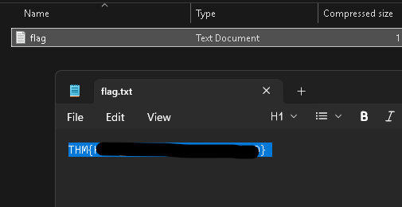

From that file, we obtain the fourth flag.

**What is the framework flag?**

> THM{REDACTED}

---

## Task 4: Developer Tools - Inspector

The Inspector tool provides a live, interactive representation of the webpage's Document Object Model (DOM) and CSS styling. Since user interaction and JavaScript can alter what is displayed, the Inspector shows the page in its current state . As a penetration tester, you can use this tool to modify HTML elements and CSS properties on the fly, which is particularly useful for bypassing client-side visual blocks like premium content paywalls (e.g., changing a blocker's CSS from `display: block` to `display: none`).

**What is the flag behind the paywall?**

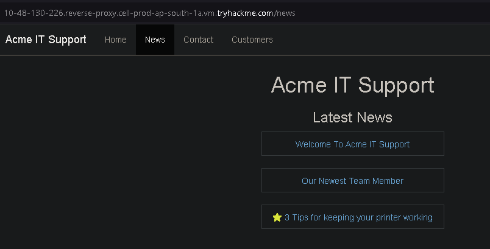

In the **News** section, we select **"3 Tips for Keeping Your Printer Working."**

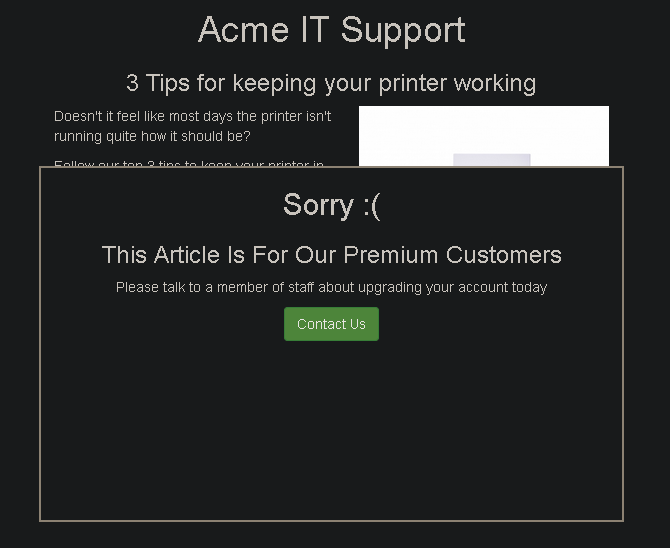

After clicking it, we find that the content is blocked by a popup overlay.

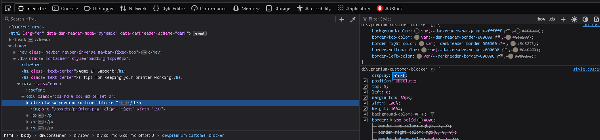

To bypass this, we can open **Inspect Element** in the browser and change the CSS property of the overlay from `block` to `none` to remove the popup box.  

Once the overlay is removed, the hidden content becomes visible and we obtain the flag.


> THM{REDACTED}

---

## Task 5: Developer Tools - Debugger

The Debugger (or Sources tab in Chrome) allows you to dig deep into a webpage's JavaScript execution. Even if the code is minified or obfuscated, you can format it using the "Pretty Print" feature. For penetration testing, the Debugger is invaluable because it lets you set breakpoints. Breakpoints force the browser to pause JavaScript execution at a specific line, enabling you to inspect variables, stop temporary pop-ups from disappearing, and understand the core logic of the application.

**What is the flag in the red box?**

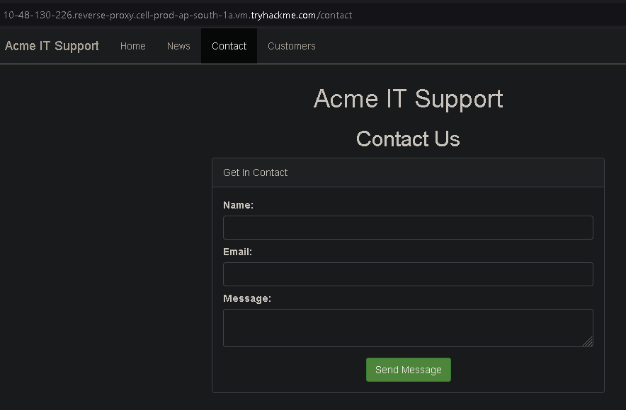

On this page, when we try to refresh it, a red box briefly appears for a split second before disappearing.

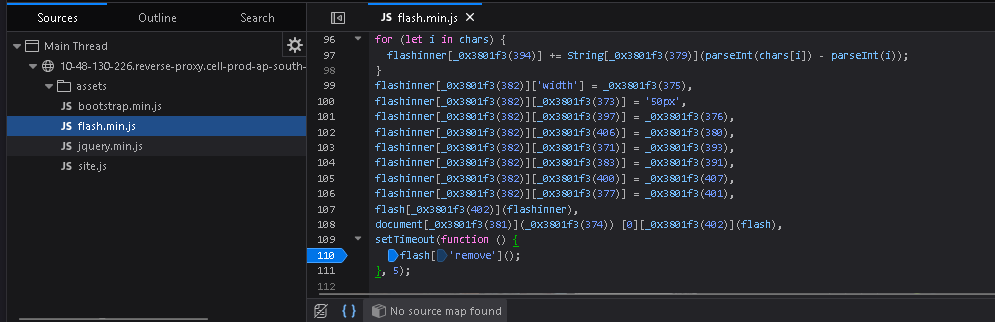

To investigate this behavior, we open **Inspect Element** and go to the **Debugger** tab.  
Next, we expand the **assets** directory until we find `flash.min.js`.

After opening the file, we enable **Pretty Print** to make the code more readable.  
At the bottom of the script, we find the line:

```js
flash['remove']();
```

We then click on that line to set a breakpoint (pause on debugger statement).
After setting the breakpoint, we refresh the page.

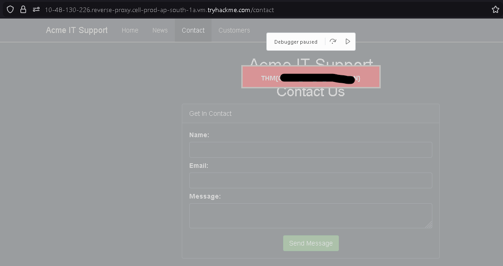

The script execution pauses before the element is removed, allowing us to see the hidden content and obtain the flag:

> THM{REDACTED}

---

## Task 6: Developer Tools - Network

The Network tab tracks and logs every single external request a webpage makes to the server . It is a critical tool for monitoring background traffic, such as data sent and received via AJAX when a user submits a form. By inspecting these network events, penetration testers can intercept hidden parameters, view the exact data payload being transmitted, and discover backend endpoints that handle the requests.

**What is the flag shown on the contact-msg network request?**

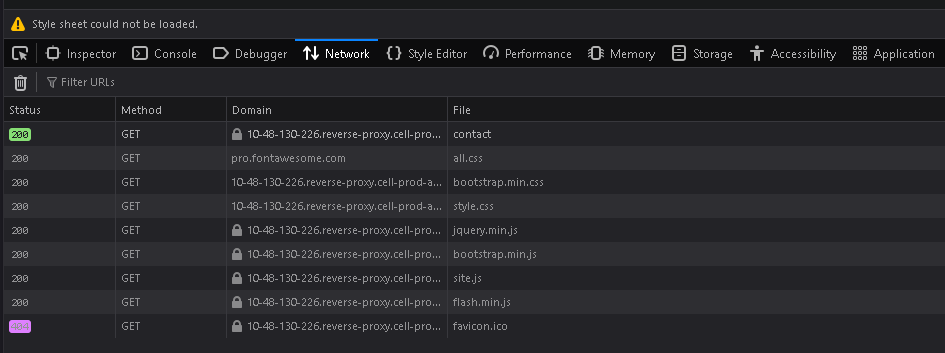

Still on the **Contact** page, disable the previous debugger breakpoint and switch to the **Network** tab in Developer Tools.

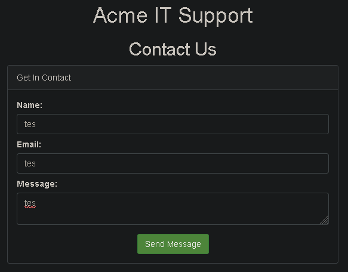

Enter any random input into the form and submit it.

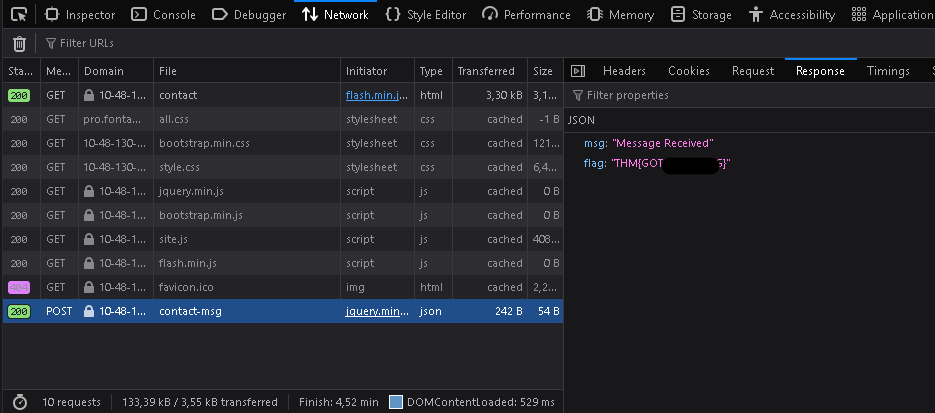

After submitting, a new request appears at the bottom of the **Network** panel.  
Click on that request, then open the **Response** tab.

Inside the response body, we can see the flag:

> THM{REDACTED}
