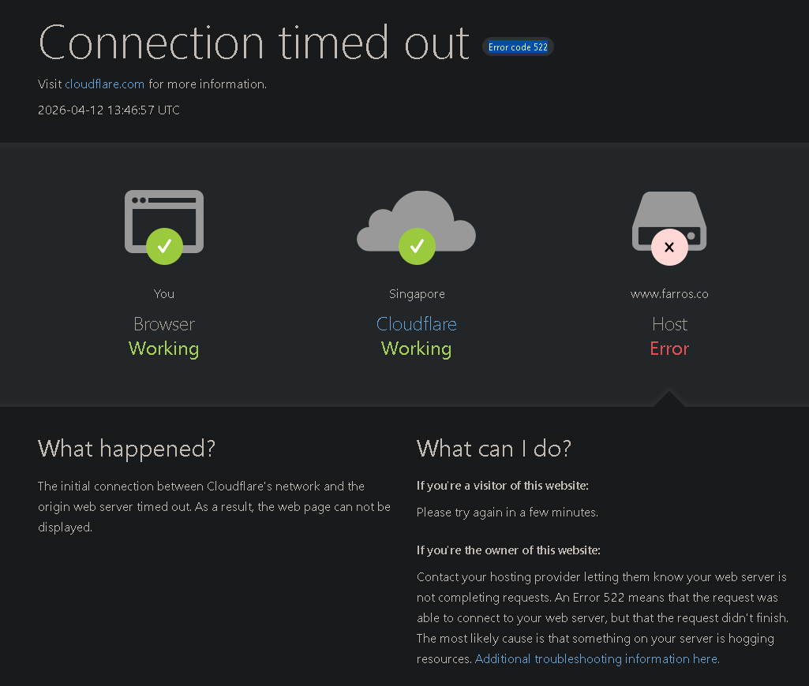
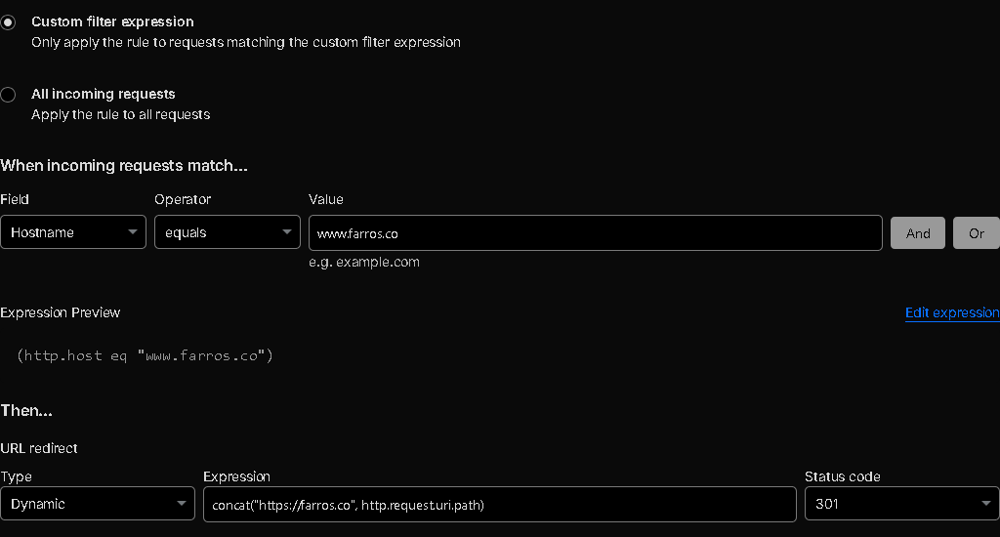

You just finished building a blazing-fast static website. You deployed it to Cloudflare Pages, linked up your custom domain, and everything looks perfect. `example.com` loads instantly.

But then, out of habit, you type `www.example.com` into your browser. Instead of your beautiful new site, you are greeted by: **Error 522: Connection timed out**.

If you check your DNS settings, everything looks correct. You have your root domain pointing to your `.pages.dev` project, and a CNAME record pointing `www` to your root domain. So, what gives?

Here is why this happens and how you can fix it.

## The Problem: Cloudflare Pages is a Strict Bouncer

When you set up a CNAME for `www` pointing to `example.com`, Cloudflare forwards the traffic to your Cloudflare Pages origin server.

However, Cloudflare Pages relies strictly on the **hostname** of the incoming request to figure out which project to serve. When a request comes in for `www.example.com`, Pages checks its internal guest list. Because you only registered `example.com` as a custom domain for your project, Pages doesn't recognize the `www` version.

Not knowing what to do with the unrecognized hostname, the server drops the connection, resulting in the dreaded Error 522.

## What is Error 522?

Before we fix it, let's briefly understand what is actually happening.

An **Error 522 (Connection timed out)** happens when Cloudflare (acting as the middleman) tries to connect to your web server (where your website actually lives), but the server takes too long to respond or doesn't respond at all.

Think of it like calling a friend on the phone. Cloudflare dials the number, but the phone just rings and rings until the call eventually drops. Cloudflare is telling you, *"I tried to reach your server, but it ghosted me."* Usually, this means a server is down or overloaded. However, in the case of Cloudflare Pages, your server isn't broken at all. It is ignoring the request on purpose because of a strict nametag policy.

## The Fix: Choose Your Path

To resolve this, you have two options depending on your preference.

### Option 1: Redirect WWW to your Root Domain (Recommended)

From an SEO and modern web design perspective, it is best practice to choose *one* version of your domain and stick to it. Redirecting `www` to your root domain (also known as the apex or naked domain) ensures search engines don't penalize you for duplicate content.

Here is how to set up a seamless, lightning-fast redirect at the edge:

1. Leave your current DNS records as they are (ensure `www` is a CNAME pointing to your root domain and is "Proxied" via the orange cloud).
2. In your Cloudflare dashboard, navigate to **Rules** in the left sidebar, then select **Redirect Rules**.
3. Click **Create rule**.
4. Name your rule something descriptive, like "Redirect WWW to Root".
5. Under **If...**, select **Custom filter expression** and configure it as follows:
   * **Field:** Hostname
   * **Operator:** equals
   * **Value:** `www.example.com` *(replace with your actual domain)*
6. Under **Then...**, configure the dynamic redirect:
   * **Type:** Dynamic
   * **Expression:** `concat("https://example.com", http.request.uri.path)` *(replace example.com with your domain)*
   * **Status code:** 301 (Permanent Redirect)
7. Click **Deploy**.

Now, anyone who stubbornly types `www` will be instantly and invisibly redirected to your clean, root domain.

### Option 2: Add WWW as a Custom Domain in Pages

If you actively *want* users to see the `www` in their address bar, you need to tell Cloudflare Pages to officially recognize it.

1. Go to your Cloudflare dashboard and click on **Workers & Pages** in the left sidebar.
2. Select your specific Pages project.
3. Navigate to the **Custom Domains** tab.
4. Click **Set up a custom domain**.
5. Enter `www.example.com` and follow the prompts to add it.

Cloudflare will automatically provision the SSL certificates and adjust the backend routing. Within a few minutes, the Error 522 will vanish, and your site will happily serve traffic on the `www` subdomain.