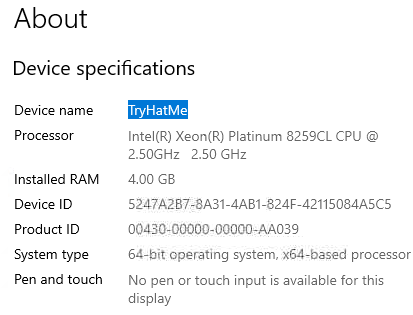
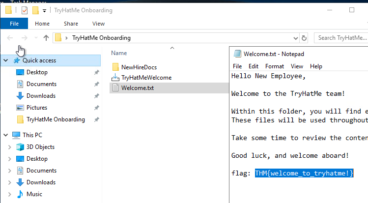
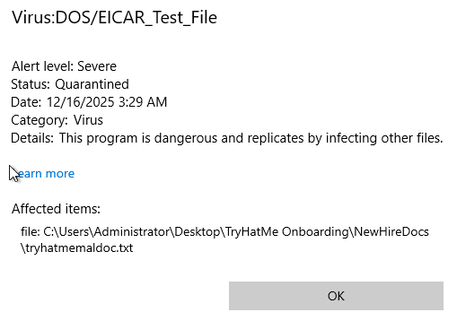

This is my write-up for the TryHackMe room on [Windows Basics](https://tryhackme.com/room/windowsbasics). Written in 2026, I hope this write-up helps others learn and practice cybersecurity.

## Task 1: Introduction

This task introduces the Microsoft Windows operating system, setting the scenario as your first day working at "TryHatMe." It outlines the learning objectives, such as navigating the graphical interface, using File Explorer, adjusting system settings, and utilizing basic tools like Task Manager. Prerequisites for this room include a foundational understanding of computer components and what an operating system is.

### Prerequisites

- [Inside a Computer System](https://tryhackme.com/room/insideacomputer)
- [Computer Types](https://tryhackme.com/room/computertypes)
- [Operating Systems: Introduction](https://tryhackme.com/room/operatingsystemsintroduction)

**I understand the learning objectives and am ready to learn about Windows!**
> No answer needed

---

## Task 2: Exploring the Windows Workspace

This section covers the evolution of Windows from early command-line interfaces to the modern GUI. It explains user authentication levels (Guest, Standard, Administrator) and breaks down the core elements of the Windows desktop, including the Taskbar, Start Menu, and built-in apps like File Explorer and Notepad. Finally, it guides you on how to check your machine's hardware and OS specifications using the "About your PC" settings and how to navigate the system's hierarchical folder structure.

**Please ensure the virtual machine is open in split-screen, then take a look at the computer's Desktop. After opening About your PC, navigate to the Device specifications section. What is the Device name specified?**

  

just follow the instruction

> TryHatMe

**Continue looking through the Device specifications. How much RAM is installed on your new work PC?**
> 4.00 GB

**Scroll down to the Windows specifications section. Which Version of Windows Server 2019 Datacenter is installed?**
> 1809

**Explore the TryHatMe Onboarding folder located on your computer's Desktop. What is the flag value found within Welcome.txt?**



> THM{welcome_to_tryhatme!}

---

## Task 3: Configuring and Securing Windows

This task focuses on application management, system configuration, and built-in security. It explains how to update, install (.exe/.msi files), and uninstall applications. You are introduced to the modern Windows Settings app and the legacy Control Panel for system configurations. Additionally, it covers how to monitor real-time system performance using Task Manager, run custom malware scans via Windows Security, and understand network traffic rules using the Windows Defender Firewall.

**Use the TryHatMeWelcome installer located within the TryHatMe Onboarding folder. What is the flag value you receive after installing and running the application?**

```bash
Hello New Employee,

Welcome to the TryHatMe team!

Within this folder, you will find everything you need to get started with your onboarding tasks.
These files will be used throughout the room to help you practice navigating Windows, managing files and folders, and exploring built-in tools.

Take some time to review the contents, follow the instructions carefully, and don’t hesitate to explore. This environment is safe to experiment in.

Good luck, and welcome aboard!

flag: THM{welcome_to_tryhatme!}
```

> THM{welcome_to_tryhatme!}


**Investigate the Time & Language section of the Windows Settings app. Which country or region is your computer currently set to?**

Use the region settings and see if United States is the answer.

> United States

**Open the Task Manager on your workstation's Desktop and navigate to the Users tab. Which account is currently logged in?**

You can right click and then click Task Manager.

> Administrator

**After performing your custom scan, click Virus:DOS/EICAR_Test_File and select See details. What is the file name shown in the Affected items section?**

Simply click Windows, then search for virus and threat protection. Then click quick scan. After that, view the results.



> tryhatmemaldoc.txt

---

## Task 4: Conclusion

The final task wraps up the "Windows Basics" room, summarizing the hands-on experience you gained while navigating Windows Server 2019. It provides a helpful glossary of key terminology covered in the room (such as Desktop, Start Menu, File Explorer, and Task Manager) and recommends further learning paths, specifically pointing toward command-line interface (CLI) basics for both Linux and Windows.

**Complete the room and continue on your cyber learning journey!**
> No answer needed

Thanks for reading. See you in the next lab.
